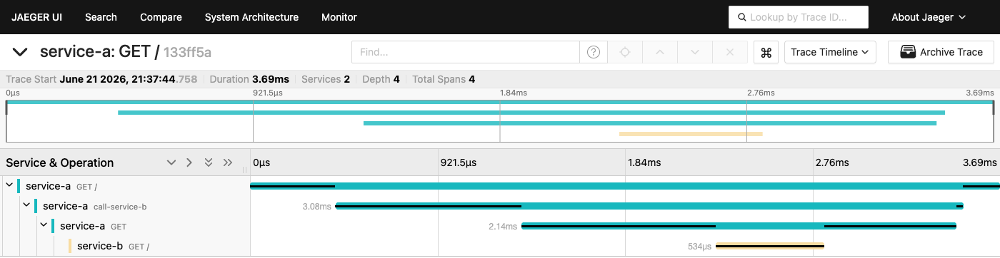

# Задание 3. Трейсинг

Технический документ: [Архитектурное решение по трейсингу.md](Архитектурное%20решение%20по%20трейсингу.md)

## Архитектурное решение (задание 3)

**Системы под трейсингом:** Shop API, CRM API, MES API, RabbitMQ (через propagation в AMQP-заголовках).

**Стек:** OpenTelemetry SDK (java-agent для Java, NuGet-пакеты для C#) -> OpenTelemetry Collector -> Jaeger.

**Ключевые данные в трейсах:** `order_id` как обязательный атрибут каждого спана, переходы статусов заказа, идентификаторы сообщений RabbitMQ, HTTP-коды и длительности.

**Мотивация:** без трейсинга команда не может понять, на каком шаге заказ завис или был потерян - расследование ведётся вручную по разрозненным логам трёх систем. Трейсинг снижает MTTR и позволяет обнаруживать потерянные заказы до жалоб клиентов.

Диаграмма с компонентами трейсинга (красным):


**Дополнительное задание - мониторинг и алертинг:** Jaeger SPM-метрики -> Grafana (алерты на зависшие заказы, аномальный расчёт стоимости, ошибки публикации в RabbitMQ) -> Alertmanager -> Slack/PagerDuty.

Диаграмма с компонентами алертинга (зелёным):


## Практическое задание 3.1: OpenTelemetry + Jaeger в Kubernetes

Два сервиса на Python/Flask с инструментированием OpenTelemetry, развёрнутые в minikube. При вызове service-a он обращается к service-b, и оба вызова попадают в один трейс в Jaeger.

**Структура:**
- [services/service-a/](services/service-a/) - Flask-сервис, принимает GET /, вызывает service-b
- [services/service-b/](services/service-b/) - Flask-сервис, принимает GET /, возвращает ответ
- [k8s/jaeger-instance.yaml](k8s/jaeger-instance.yaml) - Jaeger all-in-one deployment + service
- [k8s/services.yaml](k8s/services.yaml) - deployments и services для service-a и service-b

**Запуск:**

```bash
# Сборка образов в minikube
minikube image build -t service-a:latest services/service-a/
minikube image build -t service-b:latest services/service-b/

# Развертывание
kubectl apply -f k8s/jaeger-instance.yaml
kubectl apply -f k8s/services.yaml

# Проверка
kubectl wait --for=condition=ready pod -l app=jaeger --timeout=120s
kubectl wait --for=condition=ready pod -l app=service-a --timeout=120s
kubectl wait --for=condition=ready pod -l app=service-b --timeout=120s

# Вызов service-a, который вызывает service-b
kubectl exec -it $(kubectl get pods -l app=service-a -o jsonpath='{.items[0].metadata.name}') -- wget -qO- http://service-a:8080

# Открыть Jaeger UI
kubectl port-forward svc/jaeger 16686:16686
# Открыть в браузере: http://localhost:16686
```

**Результат трейса:**



Трейс показывает 4 спана: `service-a: GET /` -> `service-a: call-service-b` -> `service-a: GET` (исходящий HTTP) -> `service-b: GET /`. Оба сервиса попали в один трейс через автоматическую пропагацию W3C TraceContext.
